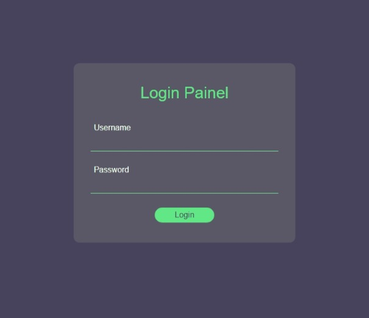

# Sistema de Login



Este projeto foi construído com Javascript puro para <strong>exemplificar uma Tela de login</strong>, consumindo os dados de um objeto que simula um banco de dados simples, na qual permite o cadastro e leitura destes usuários através de padrões de projeto conhecido por <strong>Factory, Subject & Observer</strong>.


## Uso/Exemplos
``` javascript

/* Users [Observers]:: Create a new Object User */
const user1 = createUser({name: "Bill Gates", email: "gates@admin.com", password: "0000"})

/* Database [Subject]:: Create Database  */
const userDB = createUserDB()
userDB.subscribe(user1) // Add user into Database

/* Form Input */
const bttnFormSubmit = /* ... DOM.QUERY*/
buttonFormSubmit.onClick = validateData /*Receive Form data, Match User data, Authenticate||Reject Matched User*/

```
### 1. Instancie os Usuários
``` javascript
const user1 = createUser({name: "Bill Gates", email: "gates@admin.com", password: "0000"})
```
A Factory `createUser({userData:data})` do tipo Observer é responsável por criar usuários, retornando o objeto recebido no argumento da função se todos os dados forem válidos, evitando possíveis lacunas de declaração, como duplicação de dados, permitindo a sanitização e o tratamento dos dados obtidos. Atualmente, as verificações são:
- Objeto é passado como argumento
- Valores do Objeto não são ``undefined``

Por segurança, esta Factory não permite que um usuário seja declarado com ID's, retornando `0` ao objeto, encerrando o fluxo de execução da função. O controle de atribuição de ID's está delegado à camada de registro. 

### 2. Crie a Instância da Database
``` javascript
const userDB = createUserDB()
```
A função ``createUserDB`` é uma Factory do tipo Subject que simula um banco de dados. Sua instância retorna um Array chamado `users`, que funciona como armazenador, e uma coleção de propriedades utilizadas para manipular este array. Atualmente, é possível cadastrar um usuário com `subscribe({user})`, que automaticamente atribui um ID ao objeto recebido, sendo possível também obter o retorno completo de `users[]` através de `getUsers()`.

### 3. Atribua o callback ``validateData`` à um  elemento emissor de Eventos 
``` javascript
const bttnFormSubmit = /* ... DOM.QUERY*/
buttonFormSubmit.onClick = validateData /*Receive Form data, Match User data, Authenticate||Reject Matched User*/
```

 Quando a função `validateData(evt)` entra em ação, os dados do formulario serão capturados e em seguida, comparados em loop pela função `find()` através dos valores retornados de ``userDB.getUsers()``. Se os dados do usuário comparado forem compatíveis à verificação, o usuário é retornado, o loop é encerrado e a função `validate(matchedUser)` valida ou rejeita o usuário.


## Futuras Implementações
- Área de Cadastro:
  - Salvar dados num arquivo JSON
  - Ler a partir deste arquivo 
- Filtragem do tipo de usuário:
  - Admin
  - RegularUser

## * Notas do Autor :)
- <p>Esta é a primeira vez que utilizo do conceito de padrões de projeto, eles me permitiram criar uma forma de modularizar e desacoplar as camadas do sistema, de forma que eu consiga fazer alterações moderadas em partes separadas no sistema, sem que grandes bugs me façam parar pra tomar outro café! Hahah.</p>
- <p>Estou em aprendizado para continuar evoluindo, cada dia uma nova descoberta que me torna ainda mais apaixonado pela área de Desenvolvimento.</p>